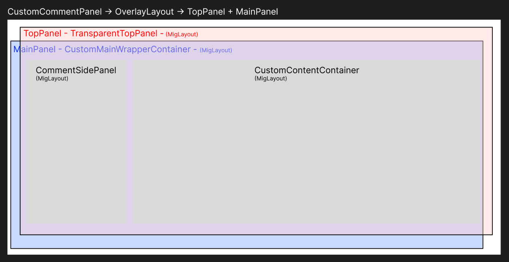

# Components explained

## Chat Bubble Structure
The chat component which gets put on the content display panel.
Each and every post by a client is stored in one of these. 

The structure is as follows:

This picture shows a bubble on the left side (representing a message from another client).

The OverlayLayout was used to avoid using .setBounds on everything. That would make it necessary to react to every resizing event manually.

## Reply Panel Structure
The reply panel is used to quote messages. 
It is shown when the reply button is pressed.

TODO: picture support in reply panes is planned.

