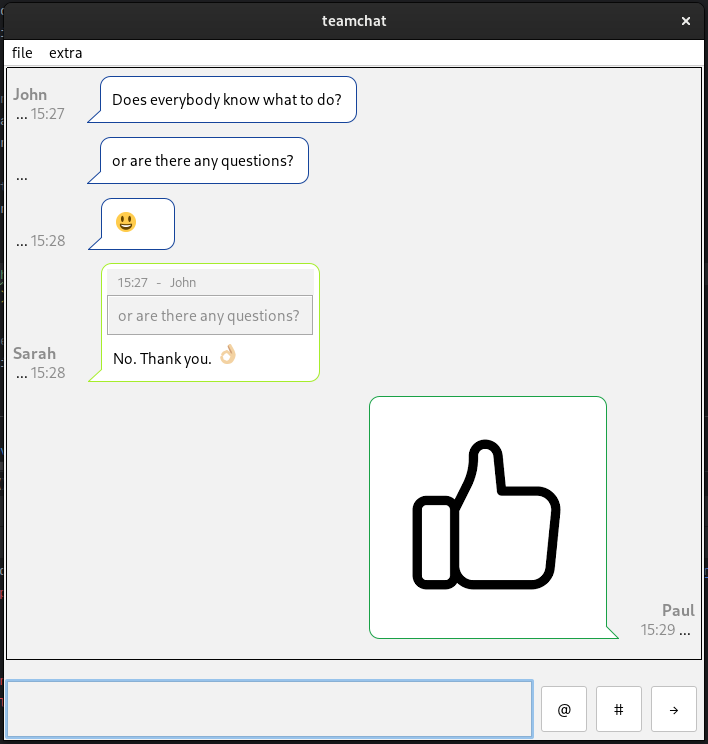

# TeamChat

<div style="text-align: center;">

</div>

TeamChat is a chat client built with Java for local network usage. This project is a hobby initiative, intended to facilitate communication within a local network via WebSocket.

## Requirements

- Java 21
- Maven 3.9.4
- [Websocket Backend](https://github.com/soeguet/teamsocket)

## Foundation

The core of TeamChat is based on TooTallNate's [Java-WebSocket](https://github.com/TooTallNate/Java-WebSocket) library and the GUI has been built using Java Swing. The back-end connects to a PostgreSQL database.

## Important

Please note that TeamChat is currently only intended for use within a local network. This is due to the absence of an additional layer of encryption.

## Features

- Basic text chat.
- Emoji support.
- Emoji reactions to messages.
- Quoting.
- Ability to edit and delete your own messages.
- Sending static images, either through a file-picker or direct clipboard recognition.
- Customizable settings, including font size and theme (white, black, IntelliJ, Darcula).
- Desktop notifications.
- Conversation history, with the last 100 messages displayed on startup.

## Usage

1. Clone the repository: 
```bash
git clone https://github.com/soeguet/teamchat
```
2. Navigate to the folder and type 
```bash
./mvnw clean install
``` 
in the terminal.

3. Run the application by typing 
```bash
java -jar target/teamchat-1.0-SNAPSHOT.jar
```

## Environment Variables
Environment variables the chat client uses are listed below: (else it will prompt you to enter a username every time you start the application)
- chat.username e.g. "John Doe" 
- chat.ip e.g. "127.0.0.1"
- chat.port e.g. "8100"

## License

TeamChat is licensed under the [MIT License](https://opensource.org/license/mit/).

### Screenshots